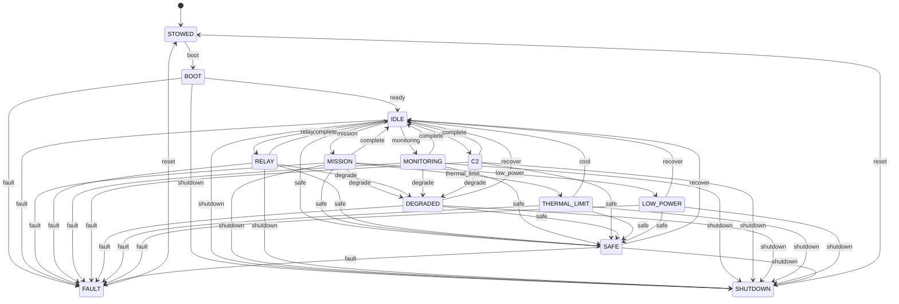

# State machine

The mission posture FSM is hand rolled (ADR 0004). The transition
table lives in `src/nous/state/machine.py` and is reviewable in one
screen. The diagram below mirrors that table; if they drift, the
diagram is wrong, not the code.

Badge: `filtered`. The FSM does not estimate, but its transitions are
audited and its refusal of unknown triggers is a hard error rather
than a silent no-op.

## Trigger surface

| Trigger | Effect | Originator (today) |
| --- | --- | --- |
| `boot` | `STOWED -> BOOT` | controller |
| `ready` | `BOOT -> IDLE` | controller |
| `mission`, `relay`, `monitoring`, `c2` | `IDLE -> <mode>` | controller |
| `degrade` | `<active mode> -> DEGRADED` | controller, or the engine's auto-safing loop (ADR 0027/0028) |
| `thermal_limit` | `MISSION -> THERMAL_LIMIT` | controller, or auto-safing on an SC-2 violation |
| `low_power` | `MISSION -> LOW_POWER` | controller, or auto-safing on an SC-8 violation |
| `safe` | `<active mode> / <impaired mode> / IDLE -> SAFE` | controller, or auto-safing on a confirmed incapacitated operator |
| `cool`, `recover` | gated recovery exits from impaired postures into `IDLE` | controller (gated, never auto-initiated) |
| `complete` | `<active mode> -> IDLE` | controller |
| `shutdown` | `<most modes> -> SHUTDOWN` | controller |
| `reset` | `FAULT -> STOWED`, `SHUTDOWN -> STOWED` | controller |
| `fault` | `<any powered mode> -> FAULT` (one trigger from every powered mode, ADR 0030) | engine or controller |

## Guards and auto-safing

Entering an operational mode is safety-gated. Every transition into
`MISSION`/`RELAY`/`MONITORING`/`C2`, and the `recover`/`cool` exits out of
the impaired modes (which land in the neutral `IDLE` but stay gated), is
gated on two STPA constraints, routed through a runtime `SafetyEnforcer`
(ADR 0018/0022): SC-2 refuses when reported thermal headroom is below the
profile threshold, and SC-8 refuses when reported state-of-charge is below
the critical reserve. Gates fail closed on missing or non-numeric context, so
a malformed profile threshold refuses rather than crashing the tick loop
(ADR 0029). `Engine.request_transition` populates the context from live
subsystem state; a refusal raises `GuardDenied`, is recorded on
`StateMachine.refusals()`, and increments the per-constraint violation
counter `device_info` surfaces.

The FSM now also initiates transitions on its own, and the safer mode
actuates. Each tick, from an operational mode, `Engine._auto_safe` drives the
device toward a safer mode when a constraint is violated mid-run (ADR
0027/0028): SC-8 fires `low_power`, SC-2 fires `thermal_limit`, a confirmed
incapacitated operator fires `safe`, and a denied comms link degrades the
link-bearing modes `RELAY`/`C2` (falling back to `degrade` where a mode lacks
the precise safer edge). Entering `LOW_POWER`/`THERMAL_LIMIT`/`SAFE` caps the
compute load (ADR 0029), so auto-safing sheds work rather than only
relabelling the posture. The operator condition is debounced (it reads the
biometrics estimate) and is the one auto-safe that can also fire from an
impaired mode, deepening it to `SAFE`. Auto-safing is one-way; recovery stays
a controller call into `IDLE`. Every auto-safing decision is mirrored to the
audit log under `Tier.SAFETY`.

The audit log records every transition. The trigger names are stable
across versions; the schema is captured in `docs/state-machine.md`
(canonical) and in this showcase page (presentation).
