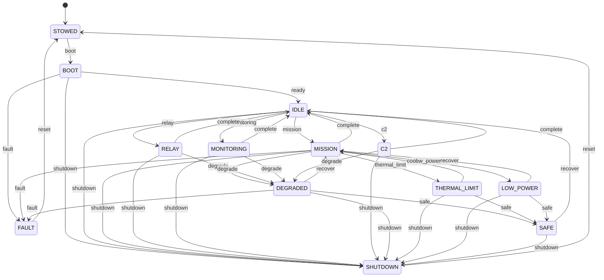

# State machine

The mission posture FSM is hand rolled (ADR 0004). The transition
table lives in `src/nous/state/machine.py` and is reviewable in one
screen. The diagram below mirrors that table; if they drift, the
diagram is wrong, not the code.

Badge: `filtered`. The FSM does not estimate, but its transitions are
audited and its refusal of unknown triggers is a hard error rather
than a silent no-op.

## Trigger surface

| Trigger | Effect | Originator (today) |
| --- | --- | --- |
| `boot` | `STOWED -> BOOT` | controller |
| `ready` | `BOOT -> IDLE` | controller |
| `mission`, `relay`, `monitoring`, `c2` | `IDLE -> <mode>` | controller |
| `degrade` | `<active mode> -> DEGRADED` | controller or, when wired, the state machine itself (BL-022) |
| `thermal_limit` | `MISSION -> THERMAL_LIMIT` | controller (DR-2 will let the FSM raise this itself when the thermal estimator lands) |
| `low_power` | `MISSION -> LOW_POWER` | controller (DR-2, again) |
| `cool`, `recover`, `safe` | exits from degraded postures | controller |
| `complete` | `<active mode> -> IDLE` | controller |
| `shutdown` | `<most modes> -> SHUTDOWN` | controller |
| `reset` | `FAULT -> STOWED`, `SHUTDOWN -> STOWED` | controller |
| `fault` | `<most modes> -> FAULT` | engine or controller |

## What it does not do today

The FSM does not yet refuse unsafe transitions on its own. DR-2 in
the STPA derived requirements records the intent: the FSM should
refuse `mission` if thermal headroom is exhausted, and should raise
`low_power` itself when the power estimator drops below a critical
threshold. That work tracks under BL-022.

The audit log records every transition. The trigger names are stable
across versions; the schema is captured in `docs/state-machine.md`
(canonical) and in this showcase page (presentation).
