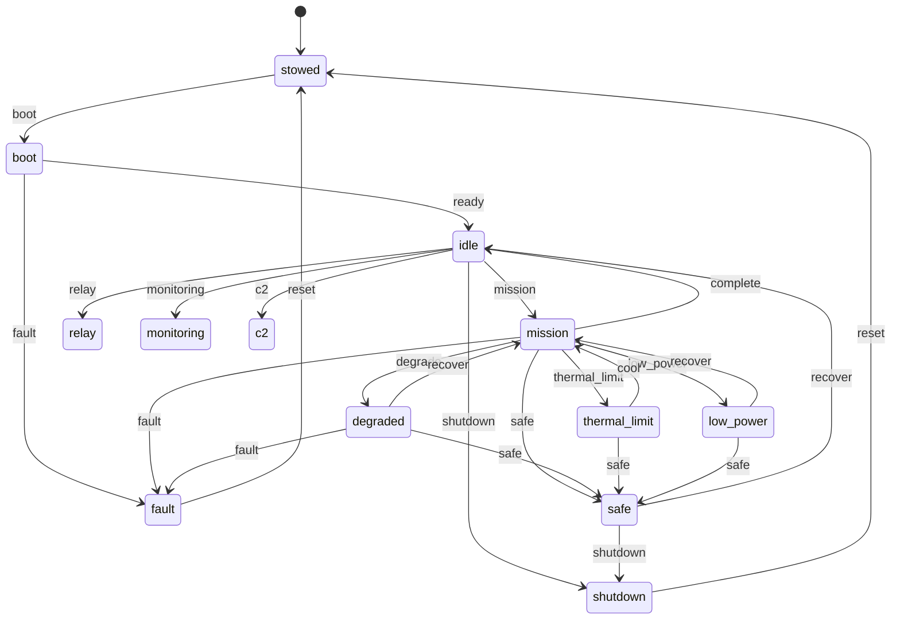

# State machine

The simulator's mission posture is a hand-rolled FSM over thirteen
modes. The transition table lives in `src/nous/state/machine.py`; this
page is the canonical reference.

## Modes

| Mode | Meaning |
|------|---------|
| `stowed` | Powered off; in the pack. |
| `boot` | Boot sequence in progress. |
| `idle` | Powered, no active mission. |
| `mission` | Active mission load (compute + comms + sensors). |
| `relay` | Acting as a relay node (comms focus). |
| `monitoring` | Environmental monitoring only. |
| `c2` | Command and control loop. |
| `degraded` | At least one subsystem outside its envelope. |
| `thermal_limit` | Thermal headroom exhausted; load throttled. |
| `low_power` | Battery SoC below threshold; non-essential off. |
| `safe` | Operator-driven safe posture. |
| `shutdown` | Cooperative shutdown in progress. |
| `fault` | Unrecoverable fault. |

## Triggers

A trigger is a string that names a transition. The allowed
`(mode, trigger)` pairs are explicit; an unknown pair raises a
`ValueError` so silent no-ops are impossible.

For readability the diagram draws `mission`'s exits in full; `relay`,
`monitoring`, and `c2` share the same `degrade`, `complete`, `safe`,
`fault`, and `shutdown` exits (ADR 0028 added the `safe` and `fault` ones
so every operational mode can reach the fail-safe state directly).

## Safety gates

Entering an operational mode is safety-gated. `_SAFETY_GATES` in
`src/nous/state/machine.py` maps each transition into `mission`, `relay`,
`monitoring`, or `c2` (and the `recover`/`cool` paths back into them) to two
STPA constraints: SC-2 floors thermal headroom at the profile threshold, and
SC-8 floors state-of-charge at the profile's critical reserve. Both fail
closed when the context is missing, so a sleeping controller cannot brick its
way into an operational mode.

The machine routes every gate through a `SafetyEnforcer` (ADR 0022). A
refused gate raises `GuardDenied` carrying the enforcer's structured reason,
the refusal is recorded on `StateMachine.refusals()`, and the enforcer
increments a per-constraint violation counter that `device_info` surfaces
under `safety`. `Engine.request_transition` fills the safety context from
live subsystem state and mirrors each check to the audit log under
`Tier.SAFETY`, so an after-action review can pull every safety event by tier
and group it by `constraint_id`.

## Auto-safing

The safety gates refuse an unsafe transition the controller *requests*;
ADR 0027 adds the other half, a control law the engine runs on itself.
On each tick, from an operational mode (`mission`, `relay`, `monitoring`,
`c2`), `Engine._auto_safe` asks the same enforcer whether the live
reported state still satisfies SC-8 (power reserve) then SC-2 (thermal
headroom). The first violated constraint fires one transition toward
safety: the mode's preferred safer trigger when the table offers one
(`low_power` for SC-8, `thermal_limit` for SC-2, both from `mission`),
otherwise `degrade`.

Auto-safing is one-way. The engine only ever moves toward a safer mode and
never auto-recovers; `recover` and `cool` stay controller calls that the
enforcer re-checks. That one-way property is the hysteresis: with no
auto-recovery there is no oscillation to damp, so the loop needs no
debounce. Each auto-safing decision is recorded to `state_history` with an
`auto-safe:` reason and mirrored to the audit log under `Tier.SAFETY`
(tool `auto_safe`).

ADR 0028 adds the two label-driven conditions on top of the enforcer
rules. An operator derived as `INCAPACITATED` takes the full `safe` posture
and outranks the device hazards (when no one can supervise, the safest hold
is right regardless of the pack or the junction); a fully denied comms link
(`DENIED`) degrades. The full priority is operator, then power (SC-8), then
thermal (SC-2), then comms. `relay`/`monitoring`/`c2` keep the `degrade`
fallback for the enforcer rules rather than gaining their own
`thermal_limit`/`low_power` edges; ADR 0028 records why.

## Reachability and classification

ADR 0028 makes the fail-safe state directly reachable from work: every
operational mode gains a `safe` trigger to `safe`, and `relay`/`monitoring`/
`c2` gain a `fault` trigger. The load-bearing invariant, checked
exhaustively in `tests/unit/test_fsm_reachability.py`, is that every
operational or impaired mode reaches `safe` in exactly one trigger, and
none of the `safe` or `fault` edges are gated. `docs/stpa/10-fsm-constraints-mapping.md`
traces each safety-relevant transition to its constraint and hazard.

`state/machine.py` exposes `is_operational`, `is_impaired`, and
`is_terminal` so the engine and the verification suite share one vocabulary
for classifying a mode. Operational modes run a workload; impaired modes
(`degraded`, `thermal_limit`, `low_power`) are safed but recoverable;
terminal modes (`shutdown`, `fault`) leave only via `reset`.

## Vocabularies

`OperatorState` and `CommsState` are derived from estimator state and are
summary labels the controller reads (see ADR-0006). Auto-safing consumes
two of their levels: `OperatorState.INCAPACITATED` and `CommsState.DENIED`
drive the label-driven safing above. The other levels remain advisory
labels the controller branches on.
