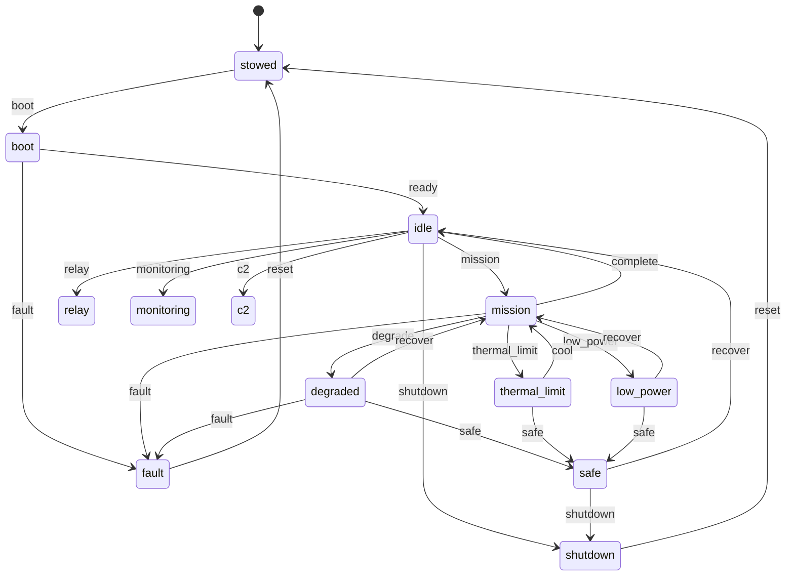

# State machine

The simulator's mission posture is a hand-rolled FSM over thirteen
modes. The transition table lives in `src/nous/state/machine.py`; this
page is the canonical reference.

## Modes

| Mode | Meaning |
|------|---------|
| `stowed` | Powered off; in the pack. |
| `boot` | Boot sequence in progress. |
| `idle` | Powered, no active mission. |
| `mission` | Active mission load (compute + comms + sensors). |
| `relay` | Acting as a relay node (comms focus). |
| `monitoring` | Environmental monitoring only. |
| `c2` | Command and control loop. |
| `degraded` | At least one subsystem outside its envelope. |
| `thermal_limit` | Thermal headroom exhausted; load throttled. |
| `low_power` | Battery SoC below threshold; non-essential off. |
| `safe` | Operator-driven safe posture. |
| `shutdown` | Cooperative shutdown in progress. |
| `fault` | Unrecoverable fault. |

## Triggers

A trigger is a string that names a transition. The allowed
`(mode, trigger)` pairs are explicit; an unknown pair raises a
`ValueError` so silent no-ops are impossible.

## Safety gates

Entering an operational mode is safety-gated. `_SAFETY_GATES` in
`src/nous/state/machine.py` maps each transition into `mission`, `relay`,
`monitoring`, or `c2` (and the `recover`/`cool` paths back into them) to two
STPA constraints: SC-2 floors thermal headroom at the profile threshold, and
SC-8 floors state-of-charge at the profile's critical reserve. Both fail
closed when the context is missing, so a sleeping controller cannot brick its
way into an operational mode.

The machine routes every gate through a `SafetyEnforcer` (ADR 0022). A
refused gate raises `GuardDenied` carrying the enforcer's structured reason,
the refusal is recorded on `StateMachine.refusals()`, and the enforcer
increments a per-constraint violation counter that `device_info` surfaces
under `safety`. `Engine.request_transition` fills the safety context from
live subsystem state and mirrors each check to the audit log under
`Tier.SAFETY`, so an after-action review can pull every safety event by tier
and group it by `constraint_id`.

## Vocabularies

`OperatorState` and `CommsState` are derived from estimator state and
*do not* drive the FSM directly. They are summary labels the
controller reads (see ADR-0006).
