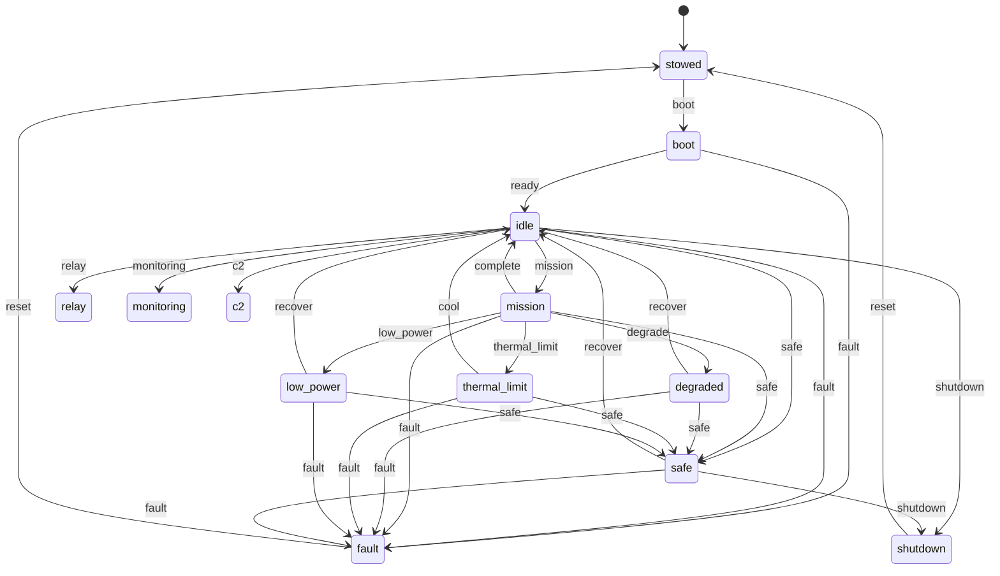

# State machine

The simulator's mission posture is a hand-rolled FSM over thirteen
modes. The transition table lives in `src/nous/state/machine.py`; this
page is the canonical reference.

## Modes

| Mode | Meaning |
|------|---------|
| `stowed` | Powered off; in the pack. |
| `boot` | Boot sequence in progress. |
| `idle` | Powered, no active mission. |
| `mission` | Active mission load (compute + comms + sensors). |
| `relay` | Acting as a relay node (comms focus). |
| `monitoring` | Environmental monitoring only. |
| `c2` | Command and control loop. |
| `degraded` | At least one subsystem outside its envelope (no load cap). |
| `thermal_limit` | Thermal headroom exhausted; compute load capped to a cool-down ceiling. |
| `low_power` | Battery SoC below threshold; compute load capped to slow the drain. |
| `safe` | Safe posture; compute load capped to a minimal heartbeat. |
| `shutdown` | Cooperative shutdown in progress. |
| `fault` | Unrecoverable fault. |

## Triggers

A trigger is a string that names a transition. The allowed
`(mode, trigger)` pairs are explicit; an unknown pair raises a
`ValueError` so silent no-ops are impossible.

For readability the diagram draws `mission`'s exits in full; `relay`,
`monitoring`, and `c2` share the same `degrade`, `complete`, `safe`,
`fault`, and `shutdown` exits (ADR 0028 added the `safe` and `fault` ones
so every operational mode can reach the fail-safe state directly). The
`recover` and `cool` triggers out of the impaired modes land in the neutral
`idle`, not back in the prior operational mode (ADR 0029): the controller
re-selects the mode it wants, re-gated. `idle` also gains direct `safe` and
`fault` edges so the failsafe and fault states are reachable from the holding
state. ADR 0030 completes the `fault`-trigger exits: every powered mode
(`thermal_limit`, `low_power`, and `safe` included) reaches the terminal
`fault` mode in one `fault` trigger, because a hardware fault is
mode-independent and must never be refused. The
operational modes do not connect to each other directly: a mode switch goes
through `idle` (via `complete`) so the new operational entry is re-gated.

## Safety gates

Entering an operational mode is safety-gated. `_SAFETY_GATES` in
`src/nous/state/machine.py` maps each transition into `mission`, `relay`,
`monitoring`, or `c2`, and the `recover`/`cool` paths out of the impaired
modes (which land in the neutral `idle` but stay gated, so a device cannot
leave an impaired posture until the hazard has cleared), to two STPA
constraints: SC-2 floors thermal headroom at the profile threshold, and SC-8
floors state-of-charge at the profile's critical reserve. Both fail closed
when the context is missing or non-numeric, so a sleeping controller cannot
brick its way into an operational mode, and a malformed profile threshold
refuses rather than crashing the tick loop (ADR 0029).

The machine routes every gate through a `SafetyEnforcer` (ADR 0022). A
refused gate raises `GuardDenied` carrying the enforcer's structured reason,
the refusal is recorded on `StateMachine.refusals()`, and the enforcer
increments a per-constraint violation counter that `device_info` surfaces
under `safety`. `Engine.request_transition` fills the safety context from
live subsystem state and mirrors each check to the audit log under
`Tier.SAFETY`, so an after-action review can pull every safety event by tier
and group it by `constraint_id`.

## Auto-safing

The safety gates refuse an unsafe transition the controller *requests*;
ADR 0027 adds the other half, a control law the engine runs on itself.
On each tick, from an operational mode (`mission`, `relay`, `monitoring`,
`c2`), `Engine._auto_safe` asks the same enforcer whether the live
reported state still satisfies SC-8 (power reserve) then SC-2 (thermal
headroom). The first violated constraint fires one transition toward
safety: the mode's preferred safer trigger when the table offers one
(`low_power` for SC-8, `thermal_limit` for SC-2, both from `mission`),
otherwise the condition's fallback (`degrade` for the enforcer hazards).

The chosen mode actuates (ADR 0029). Entering `low_power`, `thermal_limit`,
or `safe` caps the compute subsystem's delivered load to a per-mode ceiling
(`safe` 5%, `low_power` 15%, `thermal_limit` 40%) that composes with the
thermal-throttle ceiling as a minimum. So auto-safing to `low_power` genuinely
sheds load, lowers draw, and slows the drain it is named for rather than only
relabelling the posture; `degraded` keeps full load because it is the
generic/comms posture, not a power or thermal command. The controller's
requested load is preserved under the cap, so recovery to `idle` lifts it.

Auto-safing is one-way. The engine only ever moves toward a safer mode and
never auto-recovers; `recover` and `cool` stay controller calls that the
enforcer re-checks and that land in the neutral `idle`. Recovery is gated, so
a device cannot bounce back into work while the hazard persists, and the
one-way property means there is no oscillation between operational modes to
damp. Each auto-safing decision is recorded to `state_history` with an
`auto-safe:` reason and mirrored to the audit log under `Tier.SAFETY`
(tool `auto_safe`).

ADR 0028 adds the two label-driven conditions on top of the enforcer rules,
and ADR 0029 debounces the one that needs it. An operator derived as
`INCAPACITATED` takes the full `safe` posture and outranks the device hazards
(when no one can supervise, the safest hold is right regardless of the pack or
the junction). Because that label reads the biometrics Kalman estimate, it
fires only after holding for a few consecutive ticks, so a single estimator
spike cannot force a one-way `safe`; to keep the operator priority across that
debounce window, the operator condition is the one auto-safe that can also fire
from an impaired mode, deepening `low_power`/`thermal_limit`/`degraded` to
`safe`. A fully denied comms link (`DENIED`) degrades the link-bearing modes
`relay`/`c2`, leaving a comms-independent `mission` or `monitoring` run alone;
it reads reported state and stays instantaneous. The full priority is operator,
then power (SC-8), then thermal (SC-2), then comms.
`relay`/`monitoring`/`c2` keep the `degrade` fallback for the enforcer rules
rather than gaining their own `thermal_limit`/`low_power` edges; ADR 0028
records why.

## Reachability and classification

ADR 0028 makes the fail-safe state directly reachable from work: every
operational mode gains a `safe` trigger into the `safe` mode, and
`relay`/`monitoring`/`c2` gain a `fault` trigger. ADR 0030 completes the
`fault`-trigger exits so the terminal `fault` mode is one `fault` trigger from
every *powered* mode, not just the operational ones (`thermal_limit`,
`low_power`, and `safe` gained the edge). The load-bearing invariants, checked
exhaustively in `tests/unit/test_fsm_reachability.py`, are that every
operational or impaired mode reaches the `safe` mode in exactly one `safe`
trigger, every powered mode reaches the terminal `fault` mode in exactly one
`fault` trigger, and none of the `safe`/`fault` failsafe edges are gated.
`docs/stpa/10-fsm-constraints-mapping.md` traces each safety-relevant
transition to its constraint and hazard.

`state/machine.py` exposes `is_operational`, `is_impaired`, and
`is_terminal` so the engine and the verification suite share one vocabulary
for classifying a mode. Operational modes run a workload; impaired modes
(`degraded`, `thermal_limit`, `low_power`) are safed but recoverable;
terminal modes (`shutdown`, `fault`) leave only via `reset`.

## Vocabularies

`OperatorState` and `CommsState` are derived from estimator state and are
summary labels the controller reads (see ADR-0006). Auto-safing consumes
two of their levels: `OperatorState.INCAPACITATED` and `CommsState.DENIED`
drive the label-driven safing above. The other levels remain advisory
labels the controller branches on.
