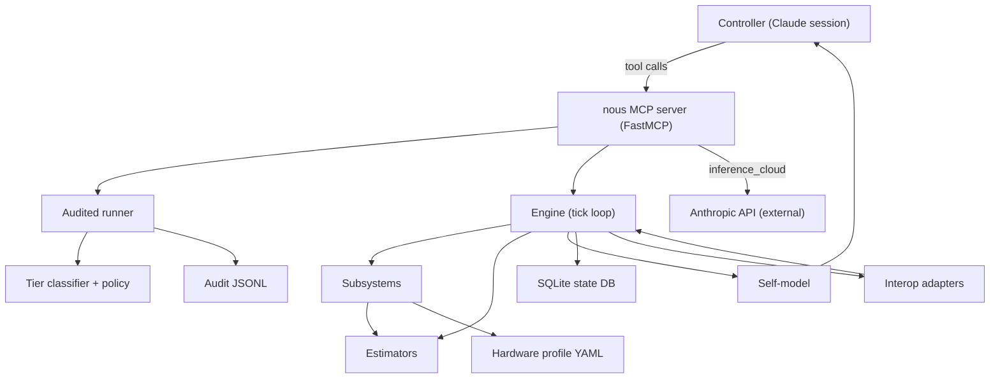

# 06 -- Control structure

The simulator exposes itself as the controlled process; the Claude
session is the controller. Refusals at the policy gate and entries in
the audit log are the *feedback* edges that allow the controller to
correct course.
