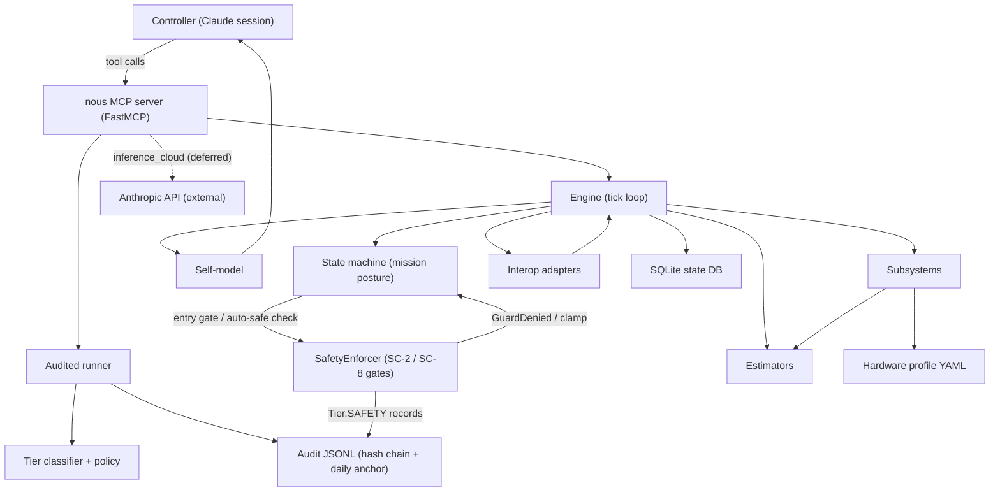

# 06 -- Control structure

The simulator exposes itself as the controlled process; the Claude session is
the controller. Two feedback loops keep the controller honest. The **policy
gate** refuses or admits a tool call and the **audit log** records every call
(hash-chained and daily-anchored), so the controller can see what it did and
what was refused. Inside the engine, the **SafetyEnforcer** is a second,
automated controller: it gates the FSM's entry transitions on SC-2 (thermal)
and SC-8 (power), and the engine's per-tick auto-safing routes the same checks
to drive the FSM out of a posture that has become unsafe (ADR 0022, 0027, 0028).
Both the policy refusals and the enforcer's `Tier.SAFETY` checks land in the
audit log, so the safety decisions are themselves reviewable.

The `inference_cloud` edge to the Anthropic API is the one control action that
reaches outside the system boundary (artefact 02). It is classified and
analysed (UCA-3a/3b, SC-5) but not yet registered as a tool; the cloud path is
deferred by design (BL-013, ADR 0033).
